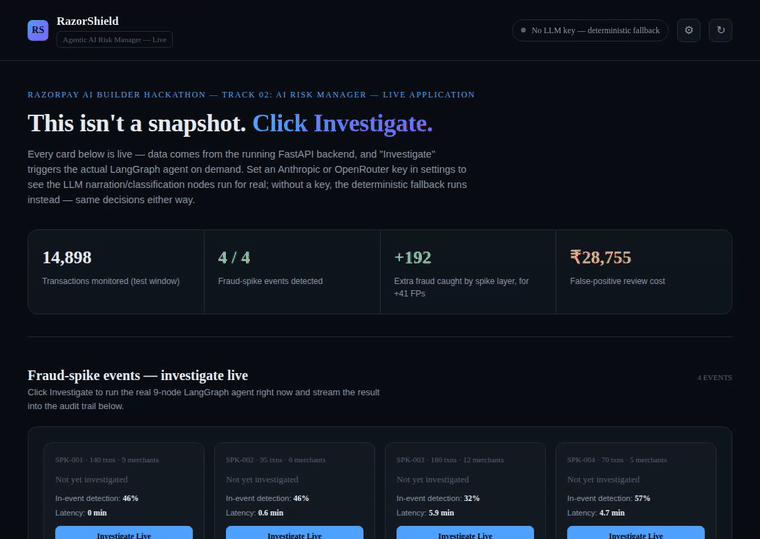

# RazorShield — Agentic AI Risk Manager for Razorpay

**Razorpay AI Buildathon · Track 02 — AI Risk Manager**
**Class of loss: coordinated fraud rings (fraud-spike detection)**


> Every transaction scored. Every cluster investigated. Every decision explained.

RazorShield pairs a supervised fraud classifier with a multi-axis
temporal anomaly layer and a LangGraph investigation agent, so
coordinated fraud rings get caught — not just individually suspicious
transactions — and every ALLOW / REVIEW / BLOCK decision comes with a
full, inspectable audit trail.



---

## Judge quickstart (60 seconds)

1. **Open the live app** — deployed URL in the submission, or
   `./run_pipeline.sh && uvicorn backend.main:app` then
   `http://localhost:8000/`.
2. **Click "Investigate Live"** on any spike card — the real 9-node
   agent runs on demand and the audit trail grows underneath.
3. **Click "Investigate Live" on the `CTRL-001` card.** This is the one
   that matters. `CTRL-001` is a genuine legitimate demand spike — a
   flash sale, not fraud — deliberately injected into the same held-out
   window with the same volume signature as a real attack. The system
   should return **ALLOW**. This is the specificity check most fraud
   demos skip entirely.
4. Optional: click the ⚙ gear, paste an OpenRouter or OpenAI key,
   re-run an investigation, and watch the two LLM nodes run for real
   instead of falling back. **The decision will not change** — which is
   the point (see [Section 4](#4-where-the-llm-is-and-where-it-deliberately-is-not)).

No server? `dashboard/index.html` opens directly in a browser — a
frozen snapshot of one full pipeline run, no install.

**Every number in this README is generated from `artifacts/` by
`evaluation/report.py`.** None of it is typed by hand, and
`tests/test_report_matches_artifacts.py` fails the build if the prose
ever drifts from the artifacts. See [Section 6](#6-why-the-numbers-cannot-drift).

---

## 1. The loss being attacked, and why one model isn't enough

Track 02 asks for one class of loss. Ours is **coordinated fraud rings** —
the case where individual transactions look unremarkable but the
*cluster* is obviously an attack.

A per-transaction classifier has a structural blind spot here, and we
measured it rather than asserting it. Against the held-out window our
XGBoost model scores **ROC-AUC 0.90 on ordinary fraud** — close to the
**0.93 Bayes ceiling** this dataset allows — but far lower on injected
ring events. That is not a training failure. Two of the four rings
distribute across near-unique devices and IPs, so there is *no
per-transaction velocity signal for any classifier to learn*. The
information simply is not in the row.

That is why RazorShield is a two-layer system:

```
Razorpay transaction stream
            │
            ▼
  ┌─────────────────────┐
  │  XGBoost risk model │  per-transaction fraud probability
  └──────────┬──────────┘   threshold chosen on VALIDATION, under a
             │              stated review-capacity budget
             ▼
  ┌──────────────────────────────────┐
  │  Temporal anomaly layer          │  15-min buckets on THREE axes:
  │  merchant × device × IP          │  merchant, device, IP
  │  strictly-prior expanding        │  + cluster ring-evidence score
  │  baseline (no look-ahead)        │
  └──────────┬───────────────────────┘
             │  cluster escalated
             ▼
  ┌──────────────────────────────────┐
  │  LangGraph investigation agent   │  9 nodes: 7 deterministic,
  │  (decision is deterministic)     │  2 optional LLM, always audited
  └──────────┬───────────────────────┘
             │
             ▼
  SHAP → root cause → severity → ALLOW / REVIEW / BLOCK → narration
             │
             ▼
     Audit trail (JSONL, append-only)
```

**Three axes, not one.** A ring that spreads thinly across many
merchants stays under any per-merchant volume alarm by construction —
while lighting up the device and IP axes. A ring that concentrates on
one merchant does the reverse. One axis catches one shape of attack.

**Escalation is a statement about the cluster, not the transaction.**
Being inside a volume anomaly is not evidence of fraud — a flash sale
is a volume anomaly. So escalation is gated on a cluster-level
*ring-evidence* score built from signals that actually separate a ring
from a rush: identity churn, merchant spread, billing-mismatch and
new-customer rates, ticket-size elevation. This is what lets the system
catch all four rings while leaving `CTRL-001` completely untouched.

---

## 2. What's in this repo

| Path | What it does |
|---|---|
| `data/generate_data.py` | Entity-based synthetic generator: 9,000 customers who own devices/IPs and transact repeatedly, so velocity features are *emergent* rather than noise columns. Labels come from an explicit logistic process with irreducible noise, and the **Bayes ceiling is computed and published** so model scores are interpretable against a real limit rather than against 1.0. Injects 4 differentiated ring events + 1 legitimate-spike control. |
| `model/train_model.py` | Feature engineering (per-merchant amount stats **fitted on train only** — no leakage) → XGBoost → **three-way temporal split** (train / validation / test) → thresholds chosen on validation from an explicit **rupee cost function**, not F1 → held-out evaluation with AUC decomposed per population → SHAP. |
| `model/spike_detector.py` | Multi-axis temporal anomaly layer. Strictly backward-looking expanding baselines (`.shift(1)`), a population absolute threshold fitted on train for entities with no history, and a cluster ring-evidence score. The one fitted threshold is fitted on validation. |
| `agent/investigation_agent.py` | LangGraph `StateGraph`, 9 nodes. Decision logic fully deterministic; the two LLM nodes run *after* the decision is final and cannot alter it. Taxonomy guardrail rejects any out-of-list model output. |
| `agent/llm_provider.py` | Provider-agnostic LLM layer — OpenRouter or OpenAI direct — with a clean "no provider configured" path the agent falls back on. |
| `backend/main.py` | FastAPI app — serves the live frontend at `/` plus `/metrics`, `/spikes`, `/spikes/{id}/investigate`, `/audit-trail`, `/timeline`, `/control-event`, `/webhooks/razorpay`. |
| `backend/razorpay_webhook.py` | Real HMAC-SHA256 signature verification and real `payment.captured` parsing. Honestly documents which features a webhook cannot provide. See [Section 5](#5-integration-with-razorpay-what-is-real-and-what-is-not). |
| `app/index.html` | The live frontend. Fetches everything over `fetch()`; no embedded data. |
| `evaluation/report.py` | **Generates every published number** into `METRICS.md` and into this README between markers. |
| `dashboard/build_dashboard.py` | Static self-contained offline report, including the PR curve and the validation cost curve. |
| `tests/` | 32 pytest tests: webhook signature verification, decision-threshold boundaries, grid-swept taxonomy guardrail, API shape, and **three drift guards** that fail if the README disagrees with the artifacts. |

### Running it

```bash
pip install -r requirements.txt
./run_pipeline.sh                              # generate → train → detect → investigate → report → dashboard
uvicorn backend.main:app --reload --port 8000  # then open http://localhost:8000/
```

Total pipeline runtime: about two minutes on a laptop CPU.
i have added the api now run and then also give me 5 min demo and presenrtin
---

## 3. Honest results

Everything below is regenerated from `artifacts/` on every pipeline run.
The full report is in [`METRICS.md`](METRICS.md).

<!-- METRICS:START -->
### How the data is split

| Window | Dates | Transactions | Fraud rate |
|---|---|---|---|
| Train | 2026-08-01 to 2026-08-07 | 22,213 | 1.6% |
| Validation | 2026-08-08 to 2026-08-09 | 6,544 | 1.7% |
| Test (held out) | 2026-08-10 to 2026-08-14 | 16,345 | 4.4% |

_Every threshold and operating point is selected on the validation window. The test window is scored once, after all choices are frozen._

### Model quality (held-out test window)

| Measure | Value |
|---|---|
| ROC-AUC, ordinary fraud population | **0.9018** |
| Bayes ceiling for this data (oracle limit) | 0.9306 |
| ROC-AUC, coordinated-ring population | 0.7350 |
| ROC-AUC, blended across both populations | 0.7889 |
| PR-AUC (blended) | 0.1898 |

The classifier reaches **0.9018 against a hard ceiling of 0.9306** on the fraud it is designed for. The ring figure is far lower and that is the finding, not a defect: two of the four injected rings distribute across near-unique devices, so no per-transaction velocity signal exists for any classifier to learn. The blended number mixes the two populations and is reported only for completeness.

### Operating points (thresholds chosen on validation, scored on test)

Cost model: **Rs 45 per manual review**, and a missed fraud costs the full transaction value plus a **Rs 750 chargeback fee**.

| Operating point | Threshold | Alert rate | Precision | Recall | FP rate | FP review cost | Net benefit vs no model |
|---|---|---|---|---|---|---|---|
| **budget_1pct (primary)** | 0.9071 | 0.7% | 41.5% | 6.9% | 0.4% | Rs 3,105 | Rs 156,616 |
| budget_2pct | 0.7986 | 2.0% | 35.4% | 16.1% | 1.3% | Rs 9,450 | Rs 338,241 |
| budget_5pct | 0.5816 | 4.6% | 25.3% | 26.7% | 3.6% | Rs 25,290 | Rs 559,555 |
| cost_optimal_unconstrained | 0.1820 | 12.7% | 15.1% | 43.9% | 11.3% | Rs 79,290 | Rs 840,038 |
| f1_optimal | 0.8069 | 1.9% | 35.9% | 15.6% | 1.3% | Rs 8,910 | Rs 327,044 |

- `cost_optimal_unconstrained` -- Lowest expected rupee cost, but it alerts on 12.7% of all traffic. Reported for completeness -- no risk-ops team can staff this, which is precisely why the deployed operating point is budget-constrained.
- `f1_optimal` -- What maximising F1 would pick. Shown to make the difference visible: F1 implicitly prices one missed fraud equal to one false alarm, which is wrong by roughly two orders of magnitude in payments.

### Standalone classifier vs the full two-layer system

| System | Precision | Recall | F1 | Alert rate | FP rate | FP review cost | Net benefit |
|---|---|---|---|---|---|---|---|
| Per-transaction XGBoost only | 41.5% | 6.9% | 11.8% | 0.7% | 0.4% | Rs 3,105 | Rs 156,616 |
| **Two-layer (model + temporal)** | 60.3% | 46.1% | 52.3% | 3.3% | 1.4% | Rs 9,765 | Rs 598,825 |

**Marginal cost of the temporal layer.** It adds **280 additional true positives for 148 additional false positives** -- a marginal review cost of **Rs 24 per extra fraudulent transaction caught**, against the Rs 45 per-review assumption used throughout. Both confusion matrices are in `artifacts/metrics.json`.

### Per-event detection (all four injected ring events)

| Event | Attack type | Txns | Device pool | Standalone recall | Combined recall | Event flagged | Latency |
|---|---|---|---|---|---|---|---|
| SPK-001 | card testing | 140 | 5% | 6.4% | 97.1% | yes | 15.0 min |
| SPK-002 | synthetic identity | 95 | 95% | 1.1% | 75.8% | yes | 15.0 min |
| SPK-003 | account takeover | 180 | 85% | 0.6% | 7.2% | yes | 5.0 min |
| SPK-004 | card testing small | 70 | 7% | 10.0% | 94.3% | yes | 5.0 min |

**4 of 4 ring events raised an alert**, with latency measured to the close of the first triggering 15-minute bucket (a bucket cannot alert before it closes, so this is the earliest a real deployment could have known).

**Where this is weakest, stated plainly.** `SPK-003` (account takeover) reaches only 7.2% transaction-level recall. It spreads 180 transactions across 12 merchants and near-unique devices, so no 15-minute aggregation on any axis sees enough concentration to act on individual transactions. The event is still escalated -- its bucket is flagged and the investigation agent routes it to a human -- but most of its individual transactions are not caught. This is the honest residual limitation of the current design.

### Specificity control: does it avoid blocking an innocent merchant?

`CTRL-001` is a **genuine legitimate demand spike** (a flash sale, 110 transactions, not fraud) injected into the same test window. A detector that flags every volume anomaly is useless no matter how good its recall looks.

| Layer | Result on CTRL-001 |
|---|---|
| Temporal layer | flagged the bucket as anomalous -- correctly, it genuinely is a volume anomaly |
| Per-transaction model | 0.0% of its transactions flagged |
| Full two-layer system | **0.0% of its transactions flagged** |
| Investigation agent | **ALLOW** at severity 0.197 (REVIEW threshold 0.35) |

Specificity cannot come from the volume signal, because the volume signal is genuinely anomalous here. It comes from the cluster-level ring-evidence score and the investigation agent, which weigh identity churn, merchant spread, device/IP reuse and mismatch rates rather than reacting to volume alone.

### Investigation agent decisions (real output, regenerated each run)

| Event | Severity | Root-cause hypothesis | Decision |
|---|---|---|---|
| CTRL-001 | 0.197 | Insufficient evidence to classify | **ALLOW** |
| SPK-001 | 0.889 | Card testing / BIN attack | **BLOCK** |
| SPK-002 | 0.530 | Synthetic identity fraud | **REVIEW** |
| SPK-003 | 0.383 | Insufficient evidence to classify | **REVIEW** |
| SPK-004 | 0.847 | Card testing / BIN attack | **BLOCK** |

Thresholds are fixed and inspectable (REVIEW at 0.35, BLOCK at 0.75) and the decision is computed from the evidence, never generated by a language model. Full reasoning chains are in `artifacts/audit_trail.jsonl`.
<!-- METRICS:END -->

---

## 4. Where the LLM is, and where it deliberately is not

The investigation agent's **decision logic** — severity scoring and the
ALLOW / REVIEW / BLOCK call — is deterministic and computed from real
values. Not because an LLM couldn't produce a plausible answer, but
because for a system that can block real money, a fixed inspectable
threshold beats free-text judgement with no reproducibility guarantee
across providers or model versions.

The two LLM nodes run *after* the decision is already final:

- **`classify_root_cause`** labels *why* a pattern looks fraudulent,
  from a fixed 7-item taxonomy, with a guardrail that rejects anything
  outside the list and substitutes a safe default. This is the
  "verifier" role in Track 02's own framing.
- **`narrate_for_analyst`** turns finalised evidence into prose a human
  can act on.

Neither can change the outcome. This holds identically with OpenRouter,
with OpenRouter, or with no key at all — so **judges never need an API
key to reproduce a single number in this README.** The audit trail
records exactly which path ran, including the fallback reason.

---

## 5. Integration with Razorpay: what is real, and what is not

Be direct about this, because overclaiming here is the fastest way to
lose a technical panel.

**What's real.** `POST /webhooks/razorpay` is a working receiver. It
implements Razorpay's actual signature scheme — HMAC-SHA256 over the
raw request body, keyed with your webhook secret, compared in constant
time against `X-Razorpay-Signature` (verified against
[Razorpay's webhook docs](https://razorpay.com/docs/webhooks/validate-test/)) —
parses the real `payment.captured` / `payment.failed` /
`payment.authorized` payload shape, and scores with the same trained
model used everywhere else. Tested end-to-end with a self-signed
request (`POST /webhooks/razorpay/simulate` generates one): a correctly
signed request verifies and scores, a tampered one is rejected with 400.

**What isn't.** It has never seen a real Razorpay merchant account,
because this project has no merchant account or live webhook secret. A
standard payment webhook also carries no device fingerprint or IP —
both core features here — so `map_payment_entity_to_features()`
substitutes an email/contact-based velocity signal and documents every
feature it cannot populate rather than quietly defaulting them to
something plausible. And this endpoint does not yet feed live events
into the temporal layer's rolling state; it demonstrates the
per-transaction scoring integration point.

**One sentence, if asked directly:** the detection architecture and its
evaluation methodology are real and reproducible; the Razorpay
*connection* is a correctly implemented webhook receiver proven against
a self-signed test, not a system that has processed a real Razorpay
transaction.

---

## 6. Why the numbers cannot drift

An earlier revision of this project shipped a README whose headline
metrics no longer matched the artifacts the pipeline actually produced —
the pipeline had been re-run and the prose had not. On a track that
grades on honest metrics, a README that disagrees with its own outputs
is worse than a weak result.

So hand-typed numbers were removed from the process entirely:

1. `evaluation/report.py` renders every metric from `artifacts/` into
   `METRICS.md` and into Section 3 of this README, between markers.
2. `tests/test_report_matches_artifacts.py` regenerates the report and
   **fails if the committed README differs**.
3. A third test scans the README prose *outside* the generated block and
   fails on any hand-typed percentage that isn't an explicitly
   allowlisted policy constant.
4. CI runs the full pipeline plus a determinism check on every push.

If you re-run `./run_pipeline.sh` and get different numbers from the
ones in Section 3, that is a reproducibility bug worth reporting — not
expected variation.

### On methodology, stated plainly

- **Synthetic data.** Not real Razorpay data; the hackathon's test-mode
  APIs weren't wired into this build. The generating process is fully
  published in `artifacts/data_generation_summary.json`, including the
  coefficients and the noise term.
- **The Bayes ceiling is published.** A model AUC without the ceiling of
  the data it ran on is not interpretable. Ours is computed by an oracle
  that knows the true generating signal but not the irreducible noise.
- **Three-way temporal split.** Thresholds and operating points are
  chosen on validation; the test window is scored once, after every
  choice is frozen.
- **No look-ahead in the temporal layer.** Baselines are expanding and
  `.shift(1)`-ed. Detection latency is measured to the *close* of the
  first triggering bucket, because a 15-minute bucket cannot raise an
  alert before it closes.
- **Detector weights are not tuned on test.** The ring-evidence weights
  come from domain reasoning. The single fitted threshold is fitted on
  validation, which contains no injected ring events.

---

## 7. Mapping to Track 02's bar

> "Build a working detector, verifier or auto-responder for one class of
> loss, with measured precision and recall on a held-out test set."
> "Honest metrics including false-positive cost. Strictly defense-only."

- **Working detector + verifier.** A running FastAPI application, not a
  report: the two-layer detector, plus the agent's `classify_root_cause`
  node acting as the verifier over a fixed taxonomy.
- **One class of loss.** Coordinated fraud rings.
- **Measured precision and recall on a held-out test set.** Section 3,
  on a temporally held-out window, at thresholds frozen on validation.
- **Honest metrics including false-positive cost.** Explicit rupee cost
  per false positive, an operating-point table that shows what each
  threshold actually costs, a published Bayes ceiling, a stated residual
  limitation (`SPK-003`), and a negative control that would expose
  volume-chasing if we were doing it.
- **Strictly defense-only.** The system scores, investigates, and
  recommends action on the merchant's own transaction stream. It has no
  capability to construct fraud, probe defenses, or act on anything
  else.

---

## 8. Honest next steps

- Swap synthetic data for real Razorpay test-mode transactions; the
  feature engineering is written to be schema-adaptable.
- Wire `/webhooks/razorpay` into the temporal layer's rolling state so a
  live attack hits the same two-layer logic proven here on batch data.
- Capture real device/IP signal at checkout (via `notes` metadata on
  order creation) so live scoring uses the feature set the model was
  actually trained on.
- **Close the `SPK-003` gap.** Distributed account-takeover spread thinly
  across many merchants is the case this design still handles poorly at
  the transaction level. A longer bucket window or a cross-merchant
  customer-cohort axis is the obvious next experiment.
- Move the in-memory webhook window (`_recent_by_key`) to Redis; it is
  demo-grade and resets on restart.
- Add a human-review UI for the REVIEW queue.

---

## License

MIT — see [LICENSE](LICENSE).
